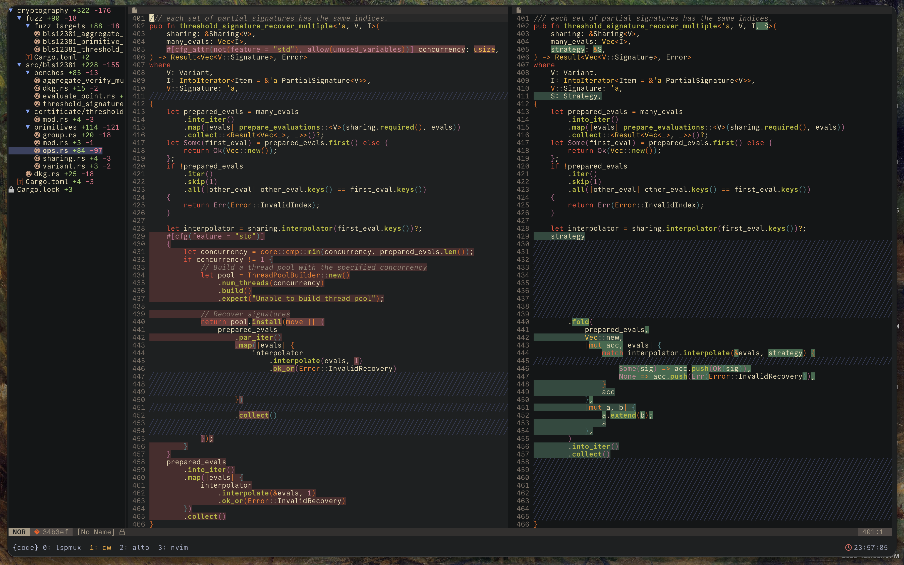

# `difftastic.nvim`

A Neovim plugin that displays [`difftastic`](https://github.com/Wilfred/difftastic)'s structural diffs in a side-by-side
view with syntax highlighting.

<p align="center">
  
</p>

## Features

- Side-by-side diff view with synchronized scrolling
- Hierarchical file tree sidebar with directory collapsing
- Syntax highlighting for the source language
- Filler lines to visually indicate alignment gaps
- Support for both [jj](https://github.com/martinvonz/jj) and [git](https://git-scm.com/) version control

## Installation

### Requirements

- Neovim 0.9+
- [nui.nvim](https://github.com/MunifTanjim/nui.nvim)
- [difftastic](https://github.com/Wilfred/difftastic) (`difft` command)
- [jj](https://github.com/martinvonz/jj) or [git](https://git-scm.com/) version control
- Rust toolchain (only if building from source)

> [!WARNING]
>
> This plugin requires difftastic with `aligned_lines` support in JSON output. This feature is available in
> [this fork](https://github.com/clabby/difftastic/tree/cl/add-aligned-lines) until
> [PR #936](https://github.com/Wilfred/difftastic/pull/936) is merged upstream.
>
> To install the fork:
> ```sh
> # Clone with 'jj'
> jj git clone https://github.com/clabby/difftastic.git \
>     --colocate \
>     -b cl/add-aligned-lines
>
> # Or, clone with 'git'
> git clone https://github.com/clabby/difftastic.git -b cl/add-aligned-lines
>
> # Install 'difft' with the 'aligned_lines' feature
> cd difftastic && cargo install --path .
> ```

### lazy.nvim (recommended)

```lua
{
    "clabby/difftastic.nvim",
    dependencies = { "MunifTanjim/nui.nvim" },
    config = function()
        require("difftastic-nvim").setup({
            download = true, -- Auto-download pre-built binary
        })
    end,
}
```

### Building from source

If you prefer to build locally or pre-built binaries aren't available for your platform:

```lua
{
    "clabby/difftastic.nvim",
    dependencies = { "MunifTanjim/nui.nvim" },
    config = function()
        require("difftastic-nvim").setup()
    end,
}
```

Requires a Rust toolchain. The plugin automatically builds from source on first use if the library isn't found.

## Usage

### Commands

| Command | Description |
|---------|-------------|
| `:Difft` | Open diff view for unstaged changes (git) or uncommitted changes (jj) |
| `:Difft --staged` | Open diff view for staged changes (git only) |
| `:Difft <ref>` | Open diff view for a jj revset or git commit/range |
| `:DifftClose` | Close the diff view |
| `:DifftUpdate` | Update to latest release (requires `download = true`) |

### Examples (jj)

```vim
" Diff uncommitted changes (working copy vs @)
:Difft

" Diff the current change
:Difft @

" Diff the parent of the current change
:Difft @-

" Diff a specific revision
:Difft abc123
```

### Examples (git)

```vim
" Diff unstaged changes (working tree vs index)
:Difft

" Diff staged changes (index vs HEAD)
:Difft --staged

" Diff the last commit
:Difft HEAD

" Diff a specific commit
:Difft abc123

" Diff a commit range
:Difft main..HEAD
```

## Keybindings

All keybindings are buffer-local and configurable via `setup()`. Defaults:

| Key | Action |
|-----|--------|
| `]f` | Next file |
| `[f` | Previous file |
| `]c` | Next hunk |
| `[c` | Previous hunk |
| `<Tab>` | Toggle focus between file tree and diff |
| `<CR>` | Open file under cursor (in file tree) |
| `gf` | Go to file at cursor position (opens in previous tab or new tab) |
| `q` | Close diff view |

The `gf` keymap works from the right pane (new/working version) and jumps to the corresponding line and column in an editable buffer. If on a filler line, it jumps to the nearest non-filler line.

Filler lines (`╱╱╱`) indicate where content exists on one side but not the other.

## Configuration

```lua
require("difftastic-nvim").setup({
    download = false,              -- Auto-download pre-built binary (default: false)
    vcs = "jj",                    -- "jj" (default) or "git"
    hunk_wrap_file = false,        -- Next hunk at last hunk goes to next file
    highlight_mode = "treesitter", -- "treesitter" (default) or "difftastic"
    keymaps = {
        next_file = "]f",
        prev_file = "[f",
        next_hunk = "]c",
        prev_hunk = "[c",
        close = "q",
        focus_tree = "<Tab>",
        focus_diff = "<Tab>",
        select = "<CR>",
        goto_file = "gf",
    },
    tree = {
        width = 40,
        icons = {
            enable = true,    -- use nvim-web-devicons if available
            dir_open = "",
            dir_closed = "",
        },
    },
    highlights = {
        -- Override any highlight group (see Highlight Groups below)
        -- DifftAdded = { bg = "#2d4a3e" },
    },
})
```

All options are optional. Only specify what you want to override.

### Highlight Modes

The `highlight_mode` option controls how syntax highlighting is applied:

- **`treesitter`** (default): Full syntax highlighting via Neovim's treesitter. Changes are shown with background colors.
- **`difftastic`**: Minimal highlighting like the CLI. No syntax colors; changes are shown with foreground colors (green/red) to make diffs more prominent.

## Highlight Groups

Highlights automatically inherit from your colorscheme's semantic groups (`Added`, `Removed`, `Directory`, `Normal`) and update when you switch themes. Background colors are derived by blending the foreground color with your `Normal` background at 25% opacity.

**Treesitter mode** (background colors):

| Group | Default | Description |
|-------|---------|-------------|
| `DifftAdded` | Derived from `Added` | Added lines background |
| `DifftRemoved` | Derived from `Removed` | Removed lines background |

**Difftastic mode** (foreground colors):

| Group | Default | Description |
|-------|---------|-------------|
| `DifftAddedFg` | Links to `Added` | Added text |
| `DifftRemovedFg` | Links to `Removed` | Removed text |
| `DifftAddedInlineFg` | `Added` + bold | Inline added text |
| `DifftRemovedInlineFg` | `Removed` + bold | Inline removed text |

**Tree**:

| Group | Default | Description |
|-------|---------|-------------|
| `DifftDirectory` | Links to `Directory` | Directory names |
| `DifftFileAdded` | Links to `Added` | Added files |
| `DifftFileDeleted` | Links to `Removed` | Deleted files |
| `DifftTreeCurrent` | Derived from `Normal` | Current file highlight |

**Other**:

| Group | Default | Description |
|-------|---------|-------------|
| `DifftFiller` | Derived from `Normal` | Filler lines for alignment gaps |

## License


[MIT](./LICENSE.md)
